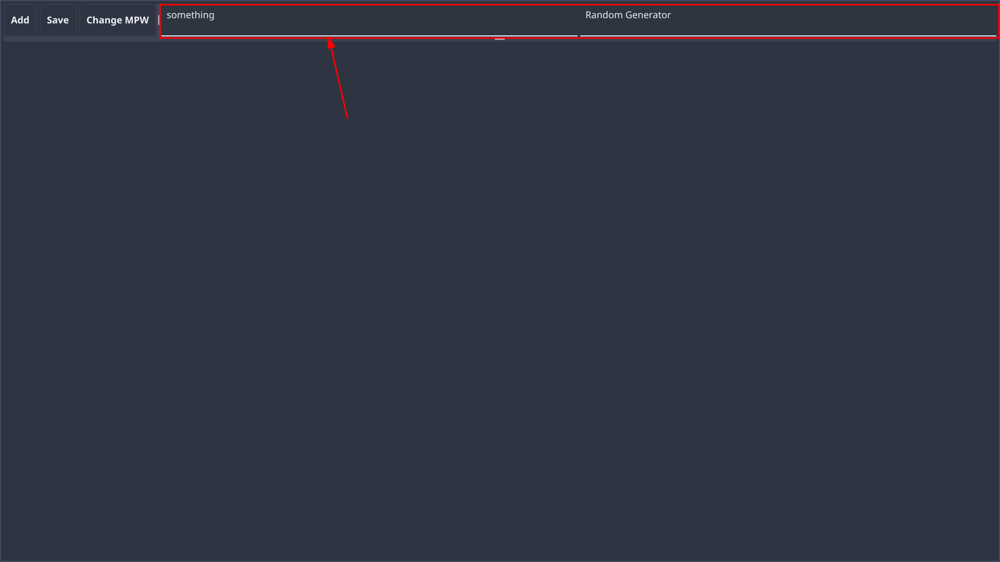
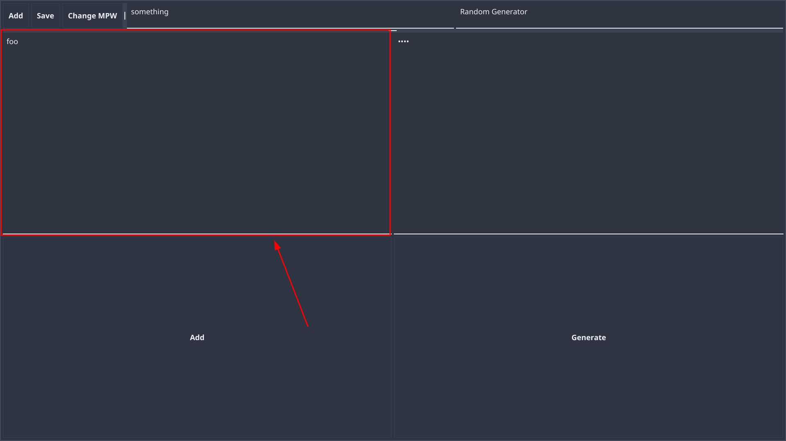

# Pmanager-go
## The most straight forward password manager

### Installation
#### Gnu/Linux
* Use precompiled pmanager-go.tar.xz with Makefile
* Or build it yourself using go

#### Windows
* Just execute pmanager-go.exe
* Or compile it yourself using go

### Usage
#### Important to know
* Save only applies if save is pressed
* There is no confirmation for deletion
* There is no backup and restore -> a changed password stays changed

#### Title entries
* Right click: enables it for change (submit change with enter)
* Left click: opens content
* If empty: will be deleted on save
 

#### Content entries
* Right click: enables it for change (submit change with enter)
* Double left click: toggles visibility of text
* Left click: copies the text to clipboard
* If empty: will be deleted on save
 

#### Buttons
* Add: adds a new entry(top -> title entry; bottom -> content entry pair)
* Save: saves the database with the provided password
* Change MPW: changes the password for database encryption(save is needed to confirm the new one)
* Generate: generates a random string with provided characters and length in "Random Generator"(default: 21 ASCII characters)
